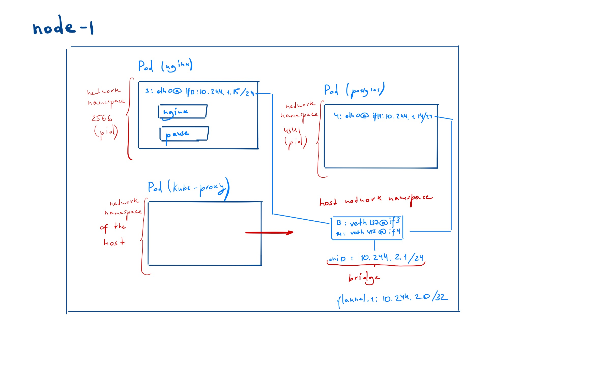

### Pod-to-pod networking
#### Pod abstraction
The Pod is an abstraction of Kubernetes . As a rule a pod is created one per application.
Usually a pod contains the container for the target application and a special purpose helper container.
Each pod has it's own _networking namespace_ that is isolated from the host where the container is running on.

---
**TIP**  
To inspect what's going on inside the pods's isolated namespace the following can be done:
1) input: ```docker inspect --format '{{ .State.Pid }}' <container-id-or-name>```  to find the PID of the pod  
output: ``<pid_id>``
2)  ```nsenter -t <pid_id> -n ip addr``` - to execute a command inside the pod network  
one command for short:
`sudo nsenter -t $(sudo docker inspect --format '{{ .State.Pid }}' <container-id-or-name>) -n ip addr`
---

Kubernetes requires all pods (no matter which node) to be like they connected to the same internet switch.
When you create a master node you define the pod's subnet with the following argument 
``--pod-network-cidr=10.244.0.0/16`` to the ``kubeadm``.  Every pods receives an ip address from this subnet.
The question is how this network is organized. 
##### pod-to-pod networking inside a node

##### pod-to-pod networking across multple nodes

